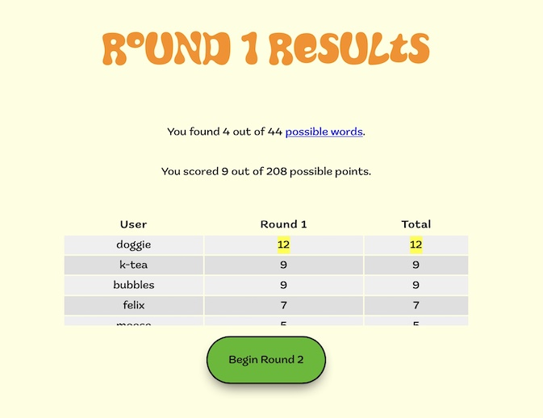

## Scramble
Scramble is a multi-player word game that utilizes various Node.js libraries,
such as Express.js, SOCKET.IO, and EJS. All players are given the same seven
letters at the same time. They compete to find the most 3-7 letter words in
30 seconds. There is no limit to the number of rounds. Players can play
the game for as long as they like.

## Screenshots

### Node.js
Node.js is an open-source, cross-platform, back-end JavaScript runtime
environment that runs on the V8 engine and executes JavaScript code
outside a web browser.

## Technologies - Server Side
Libraries used in this project::
- [Express.js](https://expressjs.com/)
- [SOCKET.IO](https://socket.io/)
- [EJS](https://ejs.co/)
- [fs API](https://nodejs.org/api/fs.html)
- [http](https://nodejs.org/api/http.html)

The [SOCKET.IO](https://github.com/socketio/chat-example) provided an excellent
starting point and a way to learn about events sent between client and server
over SOCKET.IO.

## Technologies - Client Side
Resources used in this project:
- Fonts from [Typekit](http://typekit.net/)
- Modal Box: [W3 Schools](https://www.w3schools.com/howto/howto_css_modals.asp)
- Animations: [Mdn Webdocs](https://developer.mozilla.org/en-US/docs/Web/CSS/CSS_Animations/Using_CSS_animations)
- Letter Input Widget: [InputSeven](https://github.com/andyrudoff/inputSeven)
- Code to find all possible words adapted from [Words](http://rudoff.com/words/)
